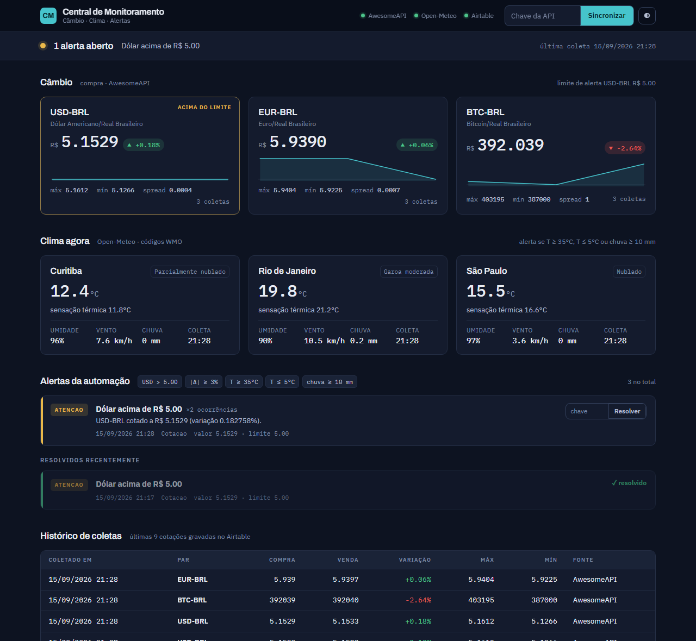

# Central Inteligente de Monitoramento — Integração de APIs

Aplicação web em **Python + Flask** que consome **duas APIs públicas** (cotações de moedas e clima), trata e normaliza os dados, persiste tudo em um **banco No-Code (Airtable)** e executa **regras de automação** que geram alertas quando limites configuráveis são ultrapassados — tudo em um único painel.

> Trabalho da disciplina **"Integração e API"** — UniFECAF, 2º semestre.

---

## Índice

1. [Visão geral](#1-visão-geral)
2. [Links do projeto](#2-links-do-projeto)
3. [O problema e a solução](#3-o-problema-e-a-solução)
4. [APIs utilizadas e por quê](#4-apis-utilizadas-e-por-quê)
5. [Arquitetura e fluxo de integração](#5-arquitetura-e-fluxo-de-integração)
6. [Tratamento dos dados](#6-tratamento-dos-dados)
7. [Modelo de dados (Airtable)](#7-modelo-de-dados-airtable)
8. [Automações](#8-automações)
9. [Autenticação e segurança](#9-autenticação-e-segurança)
10. [Interface e API própria](#10-interface-e-api-própria)
11. [Como executar](#11-como-executar)
12. [LGPD, ética e governança](#12-lgpd-ética-e-governança)
13. [Entregáveis e evidências](#13-entregáveis-e-evidências)
14. [Organização dos arquivos](#14-organização-dos-arquivos)

---

## 1. Visão geral

| | |
|---|---|
| **Stack** | Python 3.12 · Flask · Requests · Airtable REST API |
| **APIs externas** | AwesomeAPI (câmbio) · Open-Meteo (clima) |
| **Banco No-Code** | Airtable — tabelas `Cotacoes`, `Clima`, `Alertas` |
| **Autenticação** | Bearer token (Airtable) · `X-API-Key` (rotas de escrita da Central) |
| **Automações** | 4 regras: dólar acima do limite, variação brusca, temperatura extrema, chuva forte |
| **Interface** | Dashboard web: linha de estado em palavras, tiles de câmbio com sparkline e spread, clima por cidade, alertas agrupados por severidade, histórico, tema claro/escuro + API REST própria (`/api/*`) |
| **Dados monitorados** | USD-BRL · EUR-BRL · BTC-BRL · clima de São Paulo, Rio de Janeiro e Curitiba |

---

## 2. Links do projeto

- **Vídeo Pitch (YouTube):** _(inserir link)_
- **Demonstração do dashboard (artefato, dados reais):** https://claude.ai/code/artifact/5ed94314-b08d-46fe-b489-ef82ea3a6ada
- **Repositório:** https://github.com/Kenny-Barra/central-integracao
- **Base Airtable (visualização):** _(inserir link compartilhado somente leitura)_
- **Documentação das APIs:** [AwesomeAPI](https://docs.awesomeapi.com.br/api-de-moedas) · [Open-Meteo](https://open-meteo.com/en/docs) · [Airtable Web API](https://airtable.com/developers/web/api/introduction)

---

## 3. O problema e a solução

**Antes.** Uma equipe financeira/operacional precisa acompanhar o **câmbio** (compras importadas, precificação) e o **clima** (logística, entregas, equipes em campo). Essas informações vivem em sites diferentes, sem histórico consolidado e sem nenhum aviso automático quando algo sai do normal — o colaborador abre várias telas, copia números na mão e decide com dado desatualizado.

**Depois.** A Central:
- **consome** as duas APIs em uma única sincronização;
- **trata** os dados (strings → números, código WMO → texto, carimbo de data e fonte);
- **persiste** tudo no Airtable, criando histórico;
- **automatiza**: regras avaliam os dados e geram alertas classificados por severidade;
- **apresenta** em um dashboard e **expõe** uma API própria para outros sistemas.

---

## 4. APIs utilizadas e por quê

| API | Uso | Auth | Justificativa |
|---|---|---|---|
| **AwesomeAPI – Economia** | `GET /last/USD-BRL,EUR-BRL,BTC-BRL` — compra, venda, variação, máx/mín | Não exige | Brasileira, gratuita, estável; retorna vários pares em uma chamada; dados chegam como *string* (bom caso de tratamento) |
| **Open-Meteo** | `GET /v1/forecast?latitude&longitude&current=...` — temperatura, sensação, umidade, vento, chuva, código WMO | Não exige | Sem cadastro, JSON compacto, escolha exata das variáveis; código WMO numérico precisa ser traduzido |
| **Airtable REST API** | `POST/GET/PATCH /v0/{base}/{tabela}` | **Bearer PAT** | Exigido pelo trabalho; interface visual gratuita, automações nativas, limites claros (10 registros/req) |

As duas APIs são de **domínios totalmente diferentes** (financeiro e ambiental) — o que evidencia o valor de centralizar dados que jamais estariam no mesmo sistema.

---

## 5. Arquitetura e fluxo de integração

```
┌─────────────┐   GET /last/USD-BRL,...        ┌──────────────────────┐
│  AwesomeAPI │ ─────────────────────────────▶ │                      │
└─────────────┘                                │   Flask (app.py)     │   POST /v0/{base}/Cotacoes
┌─────────────┐   GET /v1/forecast?...         │                      │ ─────────────────────────▶ ┌──────────┐
│ Open-Meteo  │ ─────────────────────────────▶ │  services/cotacoes   │   POST /v0/{base}/Clima    │ Airtable │
└─────────────┘                                │  services/clima      │ ─────────────────────────▶ │ (No-Code │
                                               │  services/automacao  │   POST /v0/{base}/Alertas  │   DB)    │
                                               │  services/airtable   │ ─────────────────────────▶ └────┬─────┘
                                               └──────────┬───────────┘                                 │
                                                          │            GET /v0/{base}/...               │
                                                          ◀─────────────────────────────────────────────┘
                                               ┌──────────▼───────────┐
                                               │ Dashboard  (GET /)   │ ◀── usuário
                                               │ API própria (/api/*) │ ◀── outros sistemas
                                               └──────────────────────┘
```

**Uma sincronização** (`POST /sincronizar` pelo botão ou `POST /api/sincronizar` por outro sistema/agendador):

1. `services/cotacoes.py` chama a AwesomeAPI e normaliza a resposta.
2. `services/clima.py` chama a Open-Meteo para cada cidade — erro em uma cidade **não derruba** as demais.
3. `services/airtable.py` grava `Cotacoes` e `Clima` em lotes de 10 (limite da API).
4. `services/automacao.py` aplica as regras e devolve a lista de alertas, gravada em `Alertas`.
5. A função retorna um resumo `{cotacoes, clima, alertas, erros}` e registra no log.
6. O dashboard lê o Airtable e exibe o último valor por par/cidade, alertas e histórico.

Decisões de projeto: **histórico** (cada sincronização gera novos registros, nunca sobrescreve), **tolerância a falhas** (cada fonte em `try/except`), **timeouts** de 10–15 s em toda chamada externa, **módulo por API** (trocar de provedor = alterar um arquivo).

---

## 6. Tratamento dos dados

| Origem | Como chega | Tratamento aplicado |
|---|---|---|
| AwesomeAPI | `"bid": "5.1529"` (string) | `float()` com tolerância a valor ausente; chave `USDBRL` → `USD-BRL` |
| Open-Meteo | `"weather_code": 61` | tabela WMO → `"Chuva leve"` (pt-BR) |
| Ambas | campos com nomes diferentes | padronização: `coletado_em` (UTC ISO 8601) e `fonte` em todo registro |
| Airtable | limite de 10 registros/req | gravação em lotes; `typecast: true` para selects |
| Dashboard | ISO em UTC | filtro Jinja `data_br` → `dd/mm/aaaa HH:MM` no fuso de Brasília |

---

## 7. Modelo de dados (Airtable)

Base **Central de Monitoramento** com três tabelas independentes (séries temporais + saída da automação):

**Cotacoes** — histórico de câmbio

| Campo | Tipo |
|---|---|
| Par *(primário)* | Single line text (`USD-BRL`) |
| Nome | Single line text |
| Compra · Venda · Maxima · Minima | Number (4 casas) |
| Variacao | Number (2 casas, %) |
| ColetadoEm | Date/time (fuso São Paulo) |
| Fonte | Single line text (`AwesomeAPI`) |

**Clima** — histórico meteorológico

| Campo | Tipo |
|---|---|
| Cidade *(primário)* | Single line text |
| Temperatura · SensacaoTermica · Vento · Chuva | Number (1 casa) |
| Umidade | Number (inteiro, %) |
| Condicao | Single line text (descrição WMO em pt-BR) |
| ColetadoEm | Date/time |
| Fonte | Single line text (`Open-Meteo`) |

**Alertas** — gerados pela automação

| Campo | Tipo |
|---|---|
| Titulo *(primário)* | Single line text |
| Tipo | Single select (Cotacao · Clima) |
| Severidade | Single select (Info · Atencao · Critico) |
| Mensagem | Long text |
| Valor · Limite | Number |
| Resolvido | Checkbox |
| CriadoEm | Date/time |

---

## 8. Automações

Executadas após cada sincronização (`services/automacao.py`); limiares vêm do `.env`.

| Regra | Condição | Severidade |
|---|---|---|
| **Dólar alto** | `USD-BRL.compra > LIMITE_DOLAR` | Atenção |
| **Variação brusca** | `abs(variacao) >= 3 %` (≥ 5 % → Crítico) | Atenção / Crítico |
| **Temperatura extrema** | `temp >= LIMITE_TEMP_MAX` ou `temp <= LIMITE_TEMP_MIN` | Crítico / Atenção |
| **Chuva forte** | `chuva >= LIMITE_CHUVA_MM` | Atenção |

A automação é **idempotente**: não cria um novo alerta enquanto houver um aberto com o mesmo título (evita ruído a cada sincronização). Os alertas podem ser **resolvidos pelo dashboard** (grava `Resolvido = true` no Airtable). Como ficam na base, é possível ligar automações nativas do Airtable (e-mail, Slack) sem alterar código.

---

## 9. Autenticação e segurança

| Camada | Mecanismo |
|---|---|
| **Airtable** | *Personal Access Token* no header `Authorization: Bearer`, escopos mínimos (`data.records:read/write`), acesso a uma única base |
| **Central – escrita** | Decorator `exige_api_key`: rotas `POST /sincronizar`, `/api/sincronizar` e `/alertas/<id>/resolver` exigem `X-API-Key` (ou campo `api_key`); sem ele → **HTTP 401** |
| **Central – leitura** | Pública, pois não há dado pessoal (bastaria aplicar o mesmo decorator em cenário corporativo) |
| **Segredos** | Só no `.env` (ignorado pelo git); o repositório publica `.env.example` |
| **Transporte** | HTTPS em todas as APIs externas |
| **Entrada** | Cidades e moedas vêm de configuração, não de input do usuário — sem injeção nas URLs |

---

## 10. Interface e API própria

| Método | Rota | Auth | Descrição |
|---|---|---|---|
| GET | `/` | — | Dashboard |
| POST | `/sincronizar` | `api_key` | Sincroniza e volta ao dashboard |
| POST | `/alertas/<id>/resolver` | `api_key` | Marca alerta como resolvido |
| POST | `/api/sincronizar` | `X-API-Key` | Sincroniza e retorna resumo JSON |
| GET | `/api/cotacoes` · `/api/clima` · `/api/alertas` | — | Dados persistidos no Airtable |
| GET | `/api/ao-vivo` | — | Consulta direta às APIs externas, sem gravar |

```bash
curl -X POST http://localhost:5000/api/sincronizar -H "X-API-Key: sua-chave"
# {"alertas": 1, "clima": 3, "cotacoes": 3, "erros": []}
```

---

## 11. Como executar

Pré-requisitos: Python 3.10+ e uma conta gratuita no Airtable.

```bash
git clone https://github.com/Kenny-Barra/central-integracao.git
cd central-integracao
pip install -r requirements.txt
copy .env.example .env        # Linux/macOS: cp .env.example .env
python app.py
```

Abra <http://localhost:5000>, digite a `APP_API_KEY` e clique em **Sincronizar agora**.

**Configurando o Airtable**

1. Crie uma base com as três tabelas da [seção 7](#7-modelo-de-dados-airtable) (nomes de campos idênticos).
2. Gere um token em <https://airtable.com/create/tokens> com escopos `data.records:read` e `data.records:write` e acesso à base.
3. Preencha no `.env`:

| Variável | Descrição |
|---|---|
| `AIRTABLE_TOKEN` | PAT do Airtable (nunca versionar) |
| `AIRTABLE_BASE_ID` | ID da base (`app...`) |
| `APP_API_KEY` | chave exigida nas rotas de escrita da Central |
| `LIMITE_DOLAR` · `LIMITE_TEMP_MAX` · `LIMITE_TEMP_MIN` · `LIMITE_CHUVA_MM` | limiares das automações |
| `CIDADES` | `nome:lat:lon;...` |
| `MOEDAS` | pares AwesomeAPI separados por vírgula |

---

## 12. LGPD, ética e governança

- **Minimização:** nenhum dado pessoal é coletado — apenas indicadores públicos — o que coloca o projeto fora do escopo material da LGPD; se evoluir para cruzar com dados de clientes, exigirá base legal, controle de acesso por perfil e política de retenção.
- **Transparência e rastreabilidade:** cada registro carrega `Fonte` e `ColetadoEm`.
- **Decisão humana:** os alertas informam; não executam compra/venda nem ação automática irreversível.
- **Respeito aos provedores:** poucas chamadas por sincronização, timeouts, sem *polling* agressivo.
- **Governança:** um módulo por integração (auditável e substituível), configuração externa no `.env`, logs por sincronização, `.env` fora do Git.

Detalhamento na [Parte Teórica](docs/parte-teorica.md).

---

## 13. Entregáveis e evidências

| # | Entregável | Onde está |
|---|---|---|
| 1 | **Parte Teórica** | [`docs/parte-teorica.md`](docs/parte-teorica.md) |
| 2 | **Parte Prática** (aplicação + Airtable + automação) | código neste repositório + [`evidencias/`](evidencias/) |
| 3 | **Vídeo Pitch** | _(inserir link)_ |

Prints do sistema funcionando em [`evidencias/`](evidencias/) — e uma [demonstração navegável do dashboard](https://claude.ai/code/artifact/5ed94314-b08d-46fe-b489-ef82ea3a6ada) com os dados coletados:



---

## 14. Organização dos arquivos

```
central-integracao/
├── README.md                  ← este arquivo
├── app.py                     ← rotas Flask, fluxo de sincronização, API própria
├── config.py                  ← carrega .env (tokens, limites, cidades, moedas)
├── services/
│   ├── cotacoes.py            ← integração AwesomeAPI
│   ├── clima.py               ← integração Open-Meteo
│   ├── airtable.py            ← persistência (banco No-Code)
│   └── automacao.py           ← regras de alerta
├── templates/dashboard.html   ← interface
├── static/style.css
├── docs/parte-teorica.md      ← Parte Teórica (entregável 1)
├── evidencias/                ← prints que comprovam o sistema funcionando
├── .env.example               ← modelo de configuração (sem segredos)
└── requirements.txt
```

**Tecnologias:** Python, Flask, Requests, Airtable (banco No-Code), AwesomeAPI, Open-Meteo.
