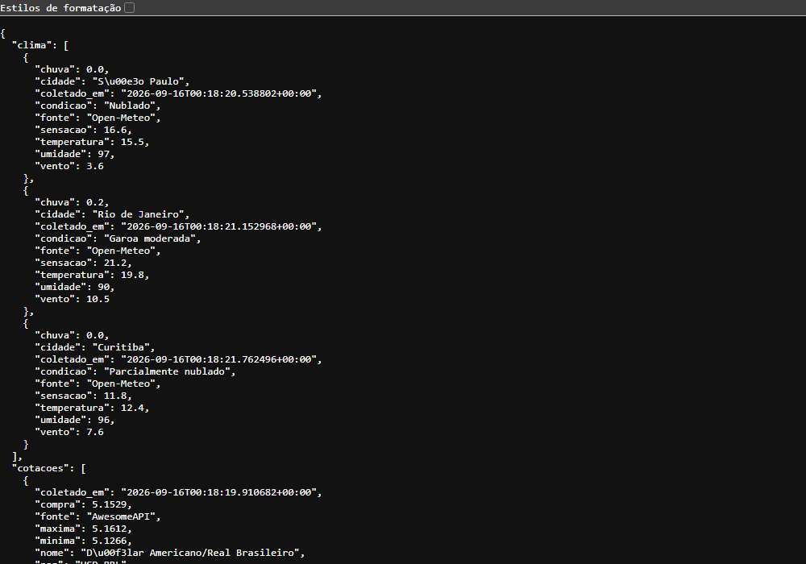
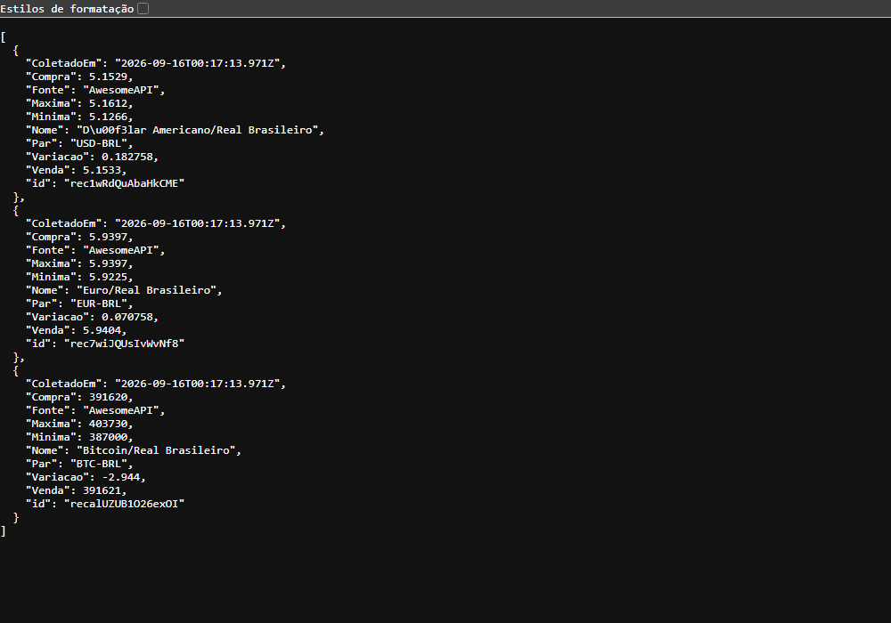
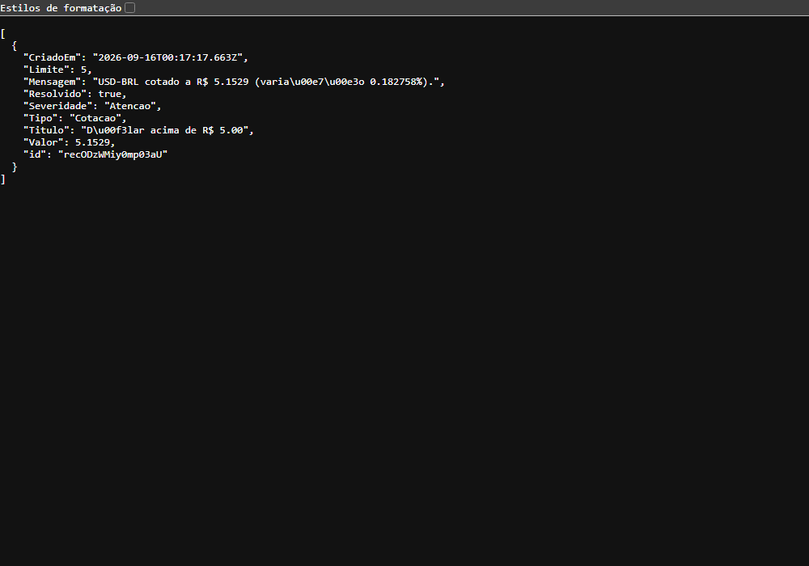
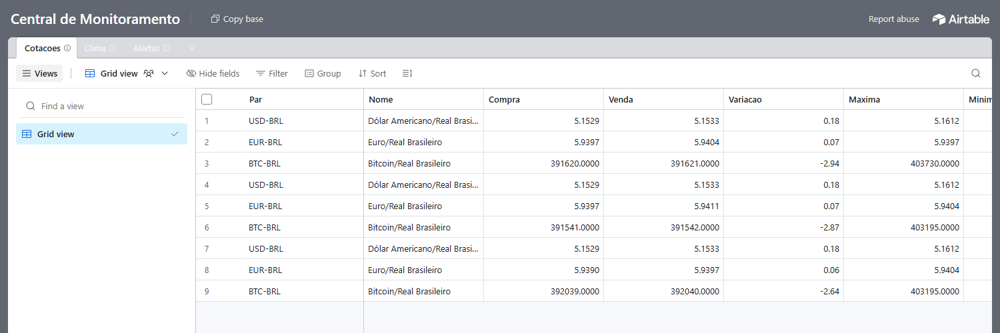
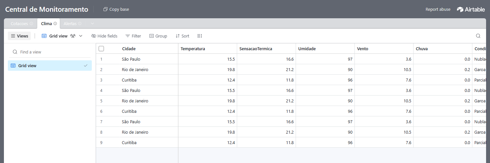
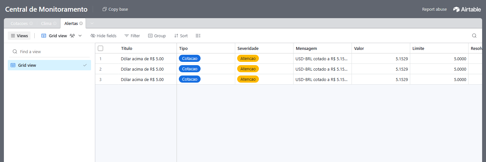

# Evidências da Parte Prática

Prints que comprovam o sistema funcionando.

## Dashboard (interface da Central)

Linha de estado em palavras (colorida pela pior severidade), tiles de câmbio com sparkline e spread, clima por cidade, alertas abertos agrupados e resolvidos, histórico de coletas. Tema claro/escuro pelo botão ◐. Versão navegável: https://claude.ai/code/artifact/5ed94314-b08d-46fe-b489-ef82ea3a6ada


## Integração com as APIs externas

### `GET /api/ao-vivo` — resposta das duas APIs já tratada (strings → números, código WMO → texto)


## Dados persistidos no Airtable, lidos pela API própria

### `GET /api/cotacoes`


### `GET /api/alertas` — alerta criado pela automação e resolvido pelo dashboard (`Resolvido: true`)


## Banco No-Code (Airtable)

### Tabela Cotacoes


### Tabela Clima


### Tabela Alertas


## Segurança

Chamada de escrita sem `X-API-Key` é rejeitada com **HTTP 401**; com a chave, a sincronização retorna o resumo.

```
$ curl -o /dev/null -w "%{http_code}" -X POST http://localhost:5000/api/sincronizar
401

$ curl -X POST http://localhost:5000/api/sincronizar -H "X-API-Key: ********"
{"alertas": 1, "clima": 3, "cotacoes": 3, "erros": []}
```
